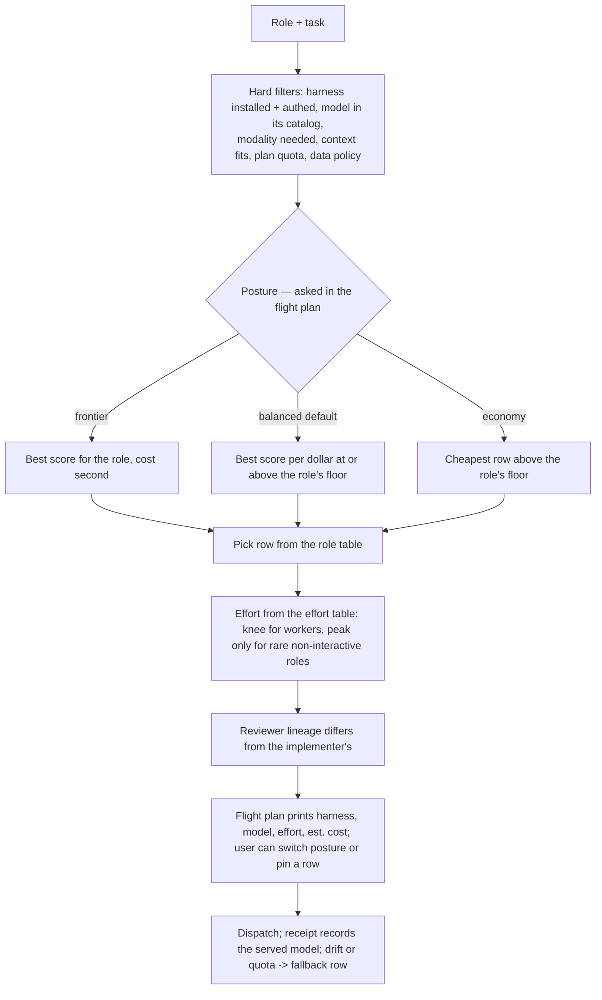

# Model selection for orchestrate — research synthesis (2026-09-30)

> Fact-checked by a fresh-context final gate (Opus): round 1 failed with 25 findings, all applied.
> Reddit evidence is search excerpts only; the Reddit-via-RSS follow-up lane stalled and was stopped.

What the orchestrator needs to pick a **harness + model + effort per role** from data: capability,
long-horizon work, context, price, modalities, computer use, effort curves, and a repeatable way to
add the next model. Research only — the skill is changed in a separate step.

Evidence grades used everywhere: **[V]** vendor-official · **[B]** independent benchmark (name,
version, date) · **[P]** practitioner report · **[L]** local probe on this machine. Numbers are as of
2026-09-30; the frontier moved three times in the eight days before this was written.

| File | Lane | What it holds |
|---|---|---|
| [01-vendor-specs.md](01-vendor-specs.md) | vendor docs | ids, context, output, price, effort levels, modalities, computer use, quirks |
| [02-cli-catalogs.md](02-cli-catalogs.md) | local probes | what each installed harness actually lists, exact id strings |
| [03-benchmarks.md](03-benchmarks.md) | leaderboards | model × benchmark matrix, gaming-resistance per benchmark, leaderboard screenshots in `.orchestrate/raw/shots/` |
| [04-x-reports.md](04-x-reports.md) | X (1,489 posts) | practitioner verdicts per model and role |
| [05-reddit-hn.md](05-reddit-hn.md) | Reddit, HN | practitioner verdicts; HN full text, Reddit as search excerpts only (a Reddit RSS lane was stopped, stuck) |
| [06-routers.md](06-routers.md) | router methods | how routers decide, proposed table schema, update procedure |
| [07-effort-curves.md](07-effort-curves.md) | effort | score, tokens and cost per effort level per model |
| [08-other-labs-harness.md](08-other-labs-harness.md) | other labs | Kimi, MiniMax, Muse, DeepSeek, Qwen, GLM, Gemini × harness |
| [09-sources-registry.md](09-sources-registry.md) | all | every re-runnable source, grouped by the column it fills |

## 1. Headline findings

1. **The frontier moved after our routing text was written.** `gpt-6.1-sol` (2026-09-29) replaced
   `gpt-6-sol`; Opus 5.5 (09-22) and Sonnet 5.5 (09-28) are new. Anthropic's own guidance: "start with
   Claude Opus 5.5 for most workloads" [V, 01]. Practitioners on X, Reddit and HN agree on **Opus 5.5 as
   the default seat**; whether Fable 5.1 keeps a planning edge is contested [P, 04, 05].
2. **Harness + model is the unit, not the model.** The same model moved 15–20 points between harnesses
   on Terminal-Bench 2.0 (Opus 4.6, Gemini 3.1 Pro — older models) [B, 03]. Artificial Analysis now scores harness+model pairs
   (Coding Agent Index); the table must key rows on (harness, model, effort).
3. **The cost spread is 10–14× for a few points.** Coding Agent Index: Claude Code + Sonnet 5.5 max
   68 at $14.2/task, Claude Code + Opus 5.5 max 66 at $13.0, **Codex + GPT-6.1 Sol xhigh 63 at
   $1.04** [B, 03]. Intelligence Index: GPT-6.1 Sol max 52 at $0.72 vs Fable 5.1 max 53 at $7.63 [B].
4. **Effort: value lives in low→high; xhigh/max buy 0–4 points at 1.2–2.8× cost per step** [B, 07].
   Two models are flat at the top (Fable 5.1 xhigh = max; Grok 4.7 high = xhigh). Max also costs
   minutes of latency (time to first output 115–694 s) — never for interactive roles.
5. **Opus 5.5 peaks at max on AA's broad indexes** (Intelligence 58, the top; Coding Agent 66, second
   to Sonnet 5.5 max at 68) at 4.5× the cost and 6.8× the tokens of its medium default [B, 07] — but
   AA reports **xhigh above max on its Terminal-Bench-Science** (62 vs 59) and practitioners (theo)
   advise avoiding max [B via X post, P, 04]. Max is workload-dependent: worth it for rare, high-stakes,
   non-interactive reasoning (architect, final gate); xhigh for long agentic terminal work; never for
   workers. AA also reports GPT-6.1 Sol xhigh beating max by 3 points (index not stated in the lane; X
   post, 2026-09-29) — two reported cases of max scoring below xhigh, no CI, no controlled study [04, 07].
6. **Fable 5.1 leads no independent coding board outright** except Scale SWE-Atlas Test Writing (67.0,
   top three read) and ties Astra on Terminal-Bench 4.0 (57.9 vs 58.2); Opus 5.5 beats it on AA,
   LMArena WebDev and FrontierSWE [B, 03], and on Cursor's first-party CursorBench [V]. Fable 5.1 leads
   Agent Arena (human preference on agent runs); practitioners' use of it for planning and design
   review is contested [B, 03 · P, 04, 05].
7. **Cheapest credible workers**: GPT-6 Luna max (AA 37 at $0.07), GPT-6.1 Sol low (42 at $0.13 —
   beats Sonnet 5.5 medium 41 at $0.59), MiMo-V2.6-Pro (46 at $0.13), DeepSeek V4.1 Flash max (39 at
   $0.27; LiveBench agentic-coding 77.3, top of that board) [B, 03, 07, 08]. Haiku 4.5 is not
   competitive [B].
8. **Sonnet 5.5 is a max-effort grinder, not a cheap worker**: weak at high (AA 47), top Coding Agent
   Index at max (68) but $14.2/task; "the least lazy model", best on one 105-bug hunt at max [B, 03 ·
   P, 04]. At medium, Opus 5.5 low is equal and cheaper [B, 07].
9. **Grok**: Grok 4.7 (AA 46 at $2.73) is dominated on price and score by GPT-6.1 Sol high and Opus 5.5
   medium; one reward-hacking report on SWE-Together [B, 03 · P, 04]. **The 2M-context Grok was
   `grok-4-1-fast`, retired 2026-05-15**; current Grok windows are 500K (CLI models) or 1M (API-only
   4.3/4.20) [V, 01].
10. **Commercial routers do not reliably beat a well-chosen single model** (LLMRouterBench, 2026-01;
    RouterEval finds a capable router can win as candidate pools grow) [B, 06]. A small, hand-curated role table with evidence gates is the right shape — which is what this
    research feeds.

## 2. How the orchestrator should decide

**Posture** is the one knob the user turns: *frontier* (quality first; architecture you cannot gamble
on), *balanced* (default), *economy* (volume work, budget-bound). The controller proposes one from the
task's risk and span; the user overrides in the flight plan.

## 3. Role table (proposal, 2026-09-30)

Rows are (harness · model · effort). Evidence column names the strongest grade behind the pick.

| Role | Frontier | Balanced (default) | Economy | Evidence |
|---|---|---|---|---|
| **Architect / redesign** (rare, high stakes, fresh context) | Claude Code · Opus 5.5 · max; second opinion Codex · GPT-6 Astra · xhigh | Claude Code · Opus 5.5 · xhigh | Codex · GPT-6.1 Sol · xhigh | AA II top at max (58) [B]; Astra ARC-AGI-2 95, TB4 tie-top [B]; practitioners keep Fable 5.1 for design review [P] |
| **Orchestrator / planner** (interactive, long session) | Claude Code · Opus 5.5 · xhigh | Claude Code · Opus 5.5 · high | Codex · GPT-6.1 Sol · high | Opus 5.5 = default seat [P, strong]; high = Anthropic knee (54 at $1.82) [B]; Fable 5.1 as orchestrator is [P, contested, n=1] — it leads Agent Arena at max [B] but costs 108 s to first output at xhigh [B] |
| **Long-horizon implementer** (well-specified tasks, hours) | Claude Code · Opus 5.5 · xhigh, or Codex · GPT-6 Astra · xhigh | Codex · GPT-6.1 Sol · xhigh | Codex · GPT-6.1 Sol · high | FrontierSWE 11-h runs: Astra 65.5, Opus 5.5 62.3; TB4.0 Astra 58.2 ±2.8 [B]; lane 07: Opus 5.5 high, xhigh for >30-min tasks; CAI Opus 5.5 66 / 6.1 Sol 63 at $13.0 / $1.04 [B] |
| **Standard worker** (multi-file, clear spec) | Claude Code · Opus 5.5 · high | Codex · GPT-6.1 Sol · high | opencode · MiMo-V2.6-Pro · high or DeepSeek V4.1 Flash · max | AA 54 / 50 / 46 / 39 at $1.82 / $0.32 / $0.13 / $0.27 [B] |
| **Cheap / mechanical worker** (code already in the plan) | Codex · GPT-6.1 Sol · medium | Codex · GPT-6 Luna · max | Codex · GPT-6 Luna · high | Luna max 37 at $0.07 [B]; "cheap trivial-fix lane" [P] |
| **Exhaustive grinder / bug hunt** | Claude Code · Sonnet 5.5 · max | Claude Code · Opus 5.5 · xhigh | Codex · GPT-6.1 Sol · xhigh | Sonnet 5.5 CAI 68 at max [B]; 105-bug hunt: Sonnet max 55.5 but xhigh 39 [P, n=1–2]; AA: Opus 5.5 xhigh 56 at $3.46 dominates Sonnet 5.5 xhigh 52 at $2.74 [B, 07] |
| **Adversarial reviewer** (lineage ≠ implementer) | Claude Code · Fable 5.1 · high, or Codex · GPT-6 Astra · high | Codex · GPT-6.1 Sol · high (Claude implementer) / Claude Code · Opus 5.5 · high (Codex implementer) | same lineage split at medium | GPT-6 Sol (6.0) was called "best adversarial code reviewer" [P, n=1]; 6.1 Sol as reviewer is unproven (one day old); open models catch 1/4–1/2 of what Fable/Opus find [P] |
| **Vision / computer use** | Claude Code · Opus 5.5 · high, and Codex · GPT-6 Astra · high as a second run | Claude Code · Opus 5.5 · high (computer toolset GA) | Gemini 3.8 Flash (opencode / agy) · high | **Conflict**: vendor OSWorld 2.1 Opus 5.5 81.8 / Sonnet 5.5 80.1 vs Astra 72.6 on OSWorld 2.0 [V, different versions]; practitioners call Astra best at CU/vision [P]; official OSWorld 2.0 has no 5.5 / GPT-6 rows; its top is Opus 5 (77.7) [B] — needs an independent re-run |
| **Long-context reader** (≥300K of input) | Claude Code · Opus 5.5 · high (1M flat price) | Claude Code · Sonnet 5.5 · high | Gemini 3.8 Flash · high via Google / OpenRouter route (1M, 242 tok/s; Zen route costs 2×) | GPT-6 bills 2× input above 272K [V]; Grok 500K [V]; effective-context benchmarks missing (gap) |
| **Peer / second opinion** (different lineage) | Codex · GPT-6 Astra · high | Codex · GPT-6.1 Sol · high | Kimi CLI · K3 · max, or Grok · 4.7 · high | lineage diversity rule; K3 AA 44 at $2.00 [B] |

Not placed (dominated or unproven): Grok 4.7 as a worker (dominated [B]); Haiku 4.5 (weak [B]); Qwen3.8
Max (worst cost/quality of its group [B]); Codex `ultra` (unmeasured, delegates on its own — refused on
lanes); Cursor CLI, Antigravity, Pi rows (not installable here, roster unverified [L]).

## 4. Capability matrix, grouped by harness

AA II = Artificial Analysis Intelligence Index v4.3.2, best config, with $ to run one index task.
CAI = AA Coding Agent Index v1.5 (harness+model). TB4 = Terminal-Bench 4.0 (±95% CI). Prices per MTok.

| Harness · model id | Ctx | $ in / out | AA II ($/task) | CAI | TB4 | Vision · CU | Speed tok/s | Default effort (enum) |
|---|---|---|---|---|---|---|---|---|
| **Claude Code** · `claude-fable-5-1` | 1M | 10 / 50 | 53 max ($7.63) | 62 | 57.9 ±3.8 | yes · yes | 69 | high (low–max) |
| Claude Code · `claude-opus-5-5` | 1M | 4 / 20 | 58 max ($5.98); 54 high ($1.82) | 66 | – | yes · yes | 74–92 | medium* (low–max) |
| Claude Code · `claude-sonnet-5-5` | 1M | 2 / 10 | 56 max ($7.60); 47 high ($1.08) | 68 | – | yes · yes | 92–139 | high (low–max) |
| Claude Code · `claude-haiku-4-5` | 200K | 1 / 5 | – | – | – | yes · no | – | none |
| **Codex** · `gpt-6-astra` | 272K (872K max) in Codex; 1.05M API† | 10 / 50 | 53 max ($3.26); 46 low ($0.82) | 62 | 58.2 ±2.8 | yes · yes | 46–55 | unknown on API; Codex catalog low (low–max, ultra) |
| Codex · `gpt-6.1-sol` | 272K (872K max) in Codex; 1.05M API† | 2 / 10 | 52 max ($0.72); 50 high ($0.32) | 63 | – | yes · yes | 59–69 | medium API / low Codex‡ |
| Codex · `gpt-6-luna` | 272K (872K max) in Codex; 1.05M API† | 0.10 / 0.50 | 37 max ($0.07) | 41 | – | yes · yes | 124–145 | medium (low–max) |
| **Grok CLI** · `grok-4.7` | 500K | 2 / 6 (4 / 12 ≥200K) | 46 high ($2.73) | 56 | 37.6 ±3.5 | yes · no | 76 | high (low–xhigh) |
| Grok CLI · `grok-4.7-build-fast` | 500K | 4 / 12 | – | – | – | – | 2× 4.7 | – |
| **Kimi CLI** · `k3` | 1M (256K on lower plans) | 3 / 15 | 44 max ($2.00) | 52 | – | yes · no | 36 | low / high / max |
| Kimi CLI · `kimi-for-coding` (now K2.8 Preview) | 1M | subscription | – | – | – | yes · no | – | low / high / max |
| **opencode** · `glm-5.3` | 1M | 1.4 / 4.4 | 45 max ($2.01) | 54 | 41.8 ±3.2 (in Claude Code) | no · no | 71 | low / high / max |
| opencode · `deepseek-v4.1-flash` | 1M | 0.15–0.30 / 0.60–1.20 | 39 max ($0.27) | – | – | yes · no | 209 | low / high / max |
| opencode · `mimo-v2.6-pro` | 1M | 0.435 / 0.87 | 46 ($0.13) | – | – | yes · no | 41 | low–high |
| opencode · `gemini-3.8-flash` (also agy) | 1M | 0.75 / 3.75 Google / OpenRouter; 1.5 / 7.5 on opencode Zen (Google's list doubles 2027-01-01) | 41 high ($1.24) | 42 (agy SDK) | 19.1 ±3.4 | yes · preview | 242 | high (low–high) |
| **Muse CLI** · `muse-spark-1.3` (also Pi, opencode) | 1M | 1.25 / 4.25 | 48 max ($1.60) | 54 | – | yes · vendor 66.9 | 181 | (none–max, ultra) |

\* Opus 5.5 default is `medium` on the API and in Claude Code. † GPT-6 input above 272K bills 2×
input / 1.5× output. ‡ Codex catalog default differs from the API default [L, 02]. Sources and
dates for every cell: 01, 03, 07, 08.

## 5. Effort guidance per model

| Model | Quality peak | Knee (best points per $) | Flat / degrading | Use |
|---|---|---|---|---|
| Opus 5.5 | max 58 (II), 66 (CAI) | high 54 ($1.82) | xhigh > max on TB-Science (62 vs 59); 694 s to first output at max | workers ≤ high; agentic terminal xhigh; architect / final gate max |
| Sonnet 5.5 | max 56 | high→xhigh +5 for 2.5× | high is weak (47); a practitioner saw max > xhigh on bugs | xhigh or max, or pick Opus 5.5 instead |
| Fable 5.1 | xhigh 53 | medium | **xhigh = max** (+0 at 1.28×); at low it can skip reasoning entirely (~0% on a 5×6-digit multiplication probe [P, n=1]) | medium–xhigh; never max, never low |
| GPT-6 Astra | max 53 | medium 50 ($1.54) | +1 per step above medium | medium/high; low (46, $0.82) = "smart worker" per several practitioners [P], but 6.1 Sol high beats it (50 at $0.32) [B] and Astra burns quota even at low [P] |
| GPT-6.1 Sol | max 52 (II); **xhigh** on CAI | high 50 ($0.32) / xhigh 51 ($0.39) | AA reports xhigh > max by 3 (index not stated; X post) | high or xhigh, never max |
| GPT-6 Luna | max 37 | high or xhigh (pennies) | – | max, or xhigh ("~95% of work" claim [P]); cheapest tested on AA's Cyber Index at max (53 at $0.12) [B] |
| Grok 4.7 | high 46 | high | **high = xhigh** | high |
| Kimi K3 | max 44 | unknown (only low 30 and max 44 measured) | – | max |
| Gemini 3.8 Flash | high 41 | medium/high | – | high |
| Codex `ultra` | unmeasured | – | delegates to its own subagents | refused on lanes |

Anthropic documents the over-thinking mode directly: at xhigh/max Sonnet 5.5 "can start its own rounds
of review and verification, sometimes with subagents" [V, 07]. Effort levels are recalibrated per
model — never carry a level across models.

## 6. Where the evidence is thin or conflicting

- **Newest models are missing from the strongest independent boards**: Terminal-Bench 4.0, METR
  (last update 2026-05-08), OSWorld 2.0, SWE-rebench lack Opus 5.5, Sonnet 5.5 and GPT-6.x Sol/Luna [B, 03].
- **No current independent vision, long-context (effective vs advertised) or computer-use numbers**
  for the 5.5 / GPT-6 generation; vision picks rest on practitioner consensus [P].
- **Practitioner data is launch-week and skewed** toward demos and promotional accounts; usage-limit
  burn claims are self-reported, not metered [P, 04, 05].
- **GPT-6.1 Sol is one day old** in all sources: strong on AA and in early reports (n = 1–3, one
  dissent). Re-check first when re-running.
- **Harnesses we cannot probe here**: Cursor CLI (broken install), Antigravity, Pi — their model
  strings are unverified [L, 02, 08].
- Sonnet 5.5's Terminal-Bench 70.6 (above Opus 5.5's 66.4) is vendor-reported from Anthropic's launch
  chart, not independent; a system-card caveat about fallback contamination was raised on HN [V, P].

## 7. What the table needs (schema) and how to keep it fresh

The proposed schema (06, section 3) keys rows on **(harness, model_id, effort)** and marks the columns
that change a routing decision: availability, status, tier, roles, one independent agentic-coding
score, intelligence index, prices, cost to run, context usable in that harness, modalities, long-horizon
evidence, plan limits, fallback, evidence grade, as-of date, source id. Empty means unknown, never zero;
never store a score without benchmark name, version and date.

Update procedure (06, section 4, condensed): identify (vendor + harness catalog) → availability probe →
price and limits → independent benchmarks (AA first, then agentic boards, then long-horizon) →
practitioner check after 7 days → place by evidence gate against the role's incumbent → one row per
harness offering → optional local probe on the role → sign-off with as-of and sources. Every source to
re-run is in [09-sources-registry.md](09-sources-registry.md).

## 8. Findings for the implementation step (not changed yet)

Items marked [L, run] were observed by the controller during this run, not by a lane.

- **Routing text is stale**: `gpt-6-sol` → `gpt-6.1-sol`; the role table in `shared-model-routing.md`
  says "opus-class / sonnet-class" with no concrete rows, no posture, no effort per role.
- **Board bug** [L, run]: `TIER_DEFAULT` has no `architect` key — the flight plan prints "session model" for it.
- **Board nit** [L, run]: `board check` flags "report landed, no review dispatched" on a `review=off` run.
- **Board bug** [L, run]: `board init PLAN --fresh` archives `.orchestrate/` before reading PLAN, so a plan kept
  inside `.orchestrate/` vanishes and init crashes (hit while starting this run).
- **Board nit** [L, run]: `board return --report` resolves the path only against `.orchestrate/`, so a report
  written elsewhere in the repo warns "does not exist" although it does.
- **Engine candidates**: Meta's `muse` CLI (headless `muse exec`, efforts none–ultra) is installed here;
  Kimi K3 is also reachable through Claude Code and Codex by base-URL config [L, V, 08].
- **This machine** [L, run + 01]: `codex` in a fresh shell is 0.144.6 (no GPT-6 models; GPT-6 Sol/Luna arrived in 0.157.0, 0.158.0 is current [V, 01]) because the
  active Node version changed; there are ~211k leftover `~/.local/state/fnm_multishells` directories;
  a lane's `droid --version` auto-updated `droid` to 0.230.0.
